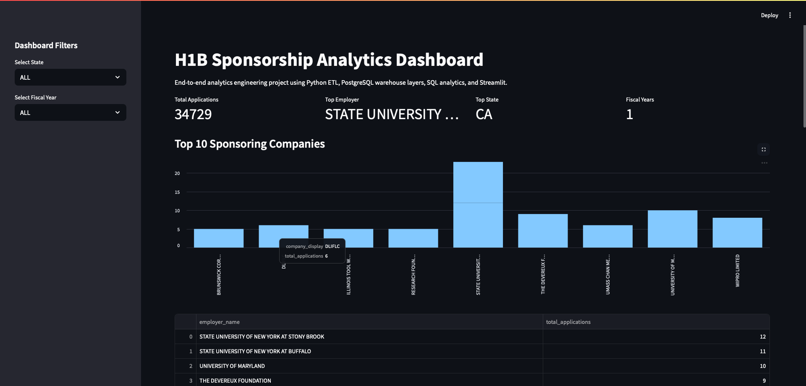
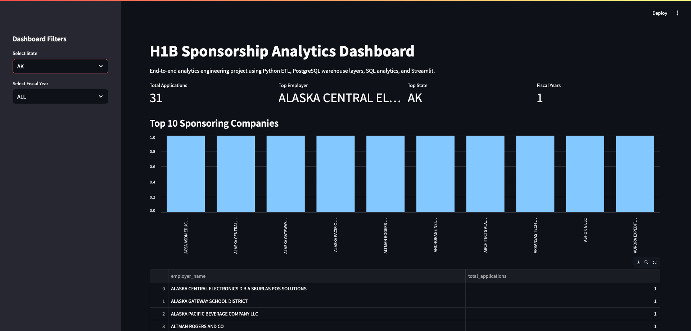
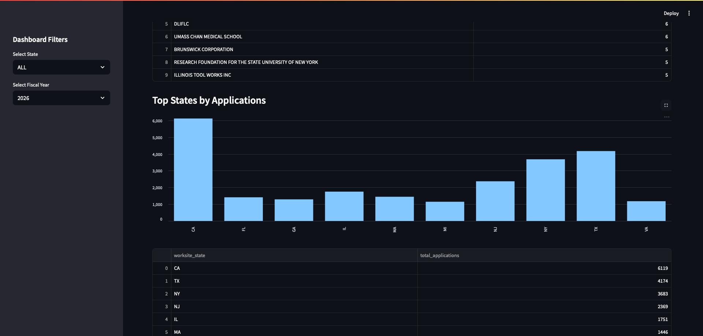

# H1B Sponsorship Analytics Platform

## Project Overview

This project analyzes H1B sponsorship data from U.S. government datasets.

The goal is to collect raw data, clean it, store it in a database, generate business insights, and display results in an interactive dashboard.

---

## Project Architecture

```text
Government Dataset
        ↓
Python ETL Pipeline
        ↓
PostgreSQL Database
        ↓
Cleaned Warehouse Layer
        ↓
Analytics Tables
        ↓
Streamlit Dashboard
```

## Technologies Used

- Python
- Pandas
- PostgreSQL
- SQLAlchemy
- SQL
- Streamlit
- Git
- GitHub

---

## Features

- Data ingestion and loading
- Data cleaning and transformation
- Data warehouse layers
- Analytics tables
- Data quality validation
- Query optimization using indexes
- Interactive dashboard

---

## Dashboard

The dashboard provides:

- Total applications
- Top sponsoring employers
- Top sponsoring states
- Fiscal year trends
- Interactive filtering

---

## How to Run

### Start PostgreSQL

```bash
docker start postgres
```

### Run Dashboard

```bash
streamlit run app.py
```

### Open Browser

```text
http://localhost:8501
```
## Data Source

The project uses publicly available H1B Labor Condition Application (LCA) datasets from the U.S. Department of Labor.

Download the dataset and place it in:

data/raw/lca_fy2025.csv

## Dashboard Preview

### Main Dashboard



### Top Companies Analysis



### State Analysis

